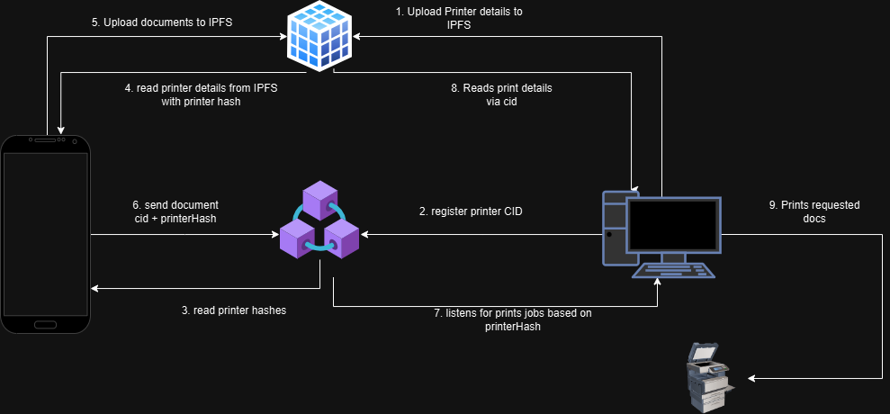

# XPrint

XPrint is a cutting-edge Print Platform as a Service (PaaS) designed to enable small and medium-sized enterprises (SMEs) to offer on-demand printing services seamlessly. Our platform empowers SMEs to provide efficient and reliable printing solutions, allowing users to request print jobs from the convenience of their location, such as hostels, and receive their printed documents through either pick-up or delivery options. 

To enhance customer satisfaction and encourage repeat business, XPrint features a comprehensive loyalty and rewards program. Users earn points for every print job ordered, which can be redeemed for discounts on future services, free delivery, or exclusive offers. By leveraging advanced technology, user-friendly interfaces, and a rewarding customer experience, XPrint transforms the traditional printing industry, making it accessible and convenient for all.

## Architecture

Xprints architecture are made up of the following parts
    

- Celo blockchain: all transactions occur on the blockchain. These includes printing service registration, printing services request, payments, and loyalty rewards tokens.

- IPFS: Stores all data including printing service provder, printing requests, and documents.

- Xprint MiniPay Dapp: This the main user facing dapp that allows users to interact with Xprint smartcontracts, make printing requests and payments with cUSD.

- Xprint Desktop: This is an installable desktop dapp designed for service providers to interface between the physical printing infrastructure and also listens for printing requests on the blockchain.

## Printing Service request processing
1. A printing service provider (SME) register on the system using the desktop up and indicates the services it will provider
2. An Xprint users via Minipay can request for a printing service, and make payments to a vault. 
3. Once the printing services is processed and printed, the vault releases the payment to the service provider, and the user gets his/her document by delivery or pickup

## Folders and Structure
- client: holds all minipay dapp codes
- desktop: holds electron desktop dapp
- hardhat: holds smartcontract and deployment codes

## Technology used
- Next JS
- Rainbowkit
- Hardhat
- Ant Design
- Minipay
- Solidity
- 
